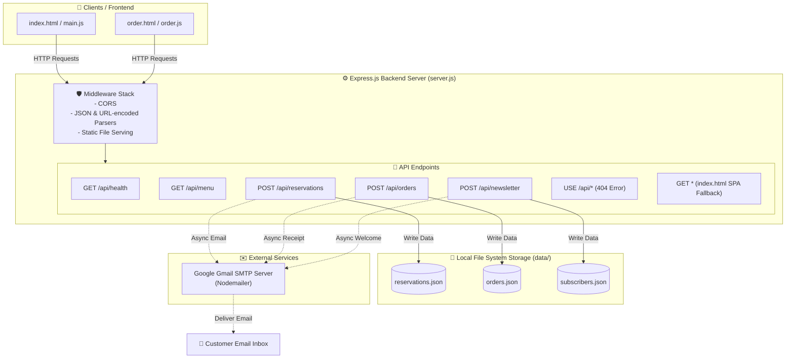

# ☕ Coffee Lounge — Backend Architecture & Flow Chart

An overview of your Node.js & Express backend ([server.js](file:///c:/Users/MITHUU/Desktop/VSCO/COFFE%20LOUNGE/server.js)), data persistence layer, API endpoints, and email notification pipelines.

---

## 🏗️ System Architecture Diagram

---

## 🔄 End-to-End Request Data Flow

```mermaid
sequenceDiagram
    autonumber
    actor Customer as 👤 Customer
    participant Frontend as 🌐 Frontend (JS)
    participant Server as ⚙️ Express (server.js)
    participant Storage as 📁 JSON Storage
    participant Mailer as ✉️ Nodemailer (Gmail)

    %% Scenario 1: Table Reservation
    rect rgb(30, 40, 60)
    note right of Customer: Scenario A: Table Reservation Inquiry
    Customer->>Frontend: Fills out Reservation Form
    Frontend->>Server: POST /api/reservations (JSON Payload)
    Server->>Server: Validate (Name, Email, Phone, Date, Time)
    Server->>Storage: Save to data/reservations.json
    Server-->>Frontend: 201 Created (Success JSON)
    Server-)Mailer: Trigger Async Confirmation Email
    Mailer-)Customer: Receive Table Confirmation Email
    end

    %% Scenario 2: Online Order
    rect rgb(40, 30, 20)
    note right of Customer: Scenario B: Online Food & Drink Order
    Customer->>Frontend: Adds items & submits Checkout
    Frontend->>Server: POST /api/orders (Items, Totals, Type)
    Server->>Server: Validate items & delivery address
    Server->>Storage: Save to data/orders.json
    Server-->>Frontend: 201 Created (Order Ref: ORD-XXXX)
    Server-)Mailer: Trigger Itemized HTML Receipt
    Mailer-)Customer: Receive Order Receipt Email
    end
```

---

## 📊 Summary of Backend Components

| Component | File / Path | Responsibility |
| :--- | :--- | :--- |
| **Server Engine** | [server.js](file:///c:/Users/MITHUU/Desktop/VSCO/COFFE%20LOUNGE/server.js) | Initializes Express, routes HTTP requests, handles auto-port fallback (5000 -> 5001). |
| **Config Credentials** | [.env](file:///c:/Users/MITHUU/Desktop/VSCO/COFFE%20LOUNGE/.env) | Stores Gmail SMTP authentication credentials safely outside code. |
| **Reservations Store** | [data/reservations.json](file:///c:/Users/MITHUU/Desktop/VSCO/COFFE%20LOUNGE/data/reservations.json) | Stores all confirmed table reservation records. |
| **Orders Store** | [data/orders.json](file:///c:/Users/MITHUU/Desktop/VSCO/COFFE%20LOUNGE/data/orders.json) | Stores all customer food & drink orders with itemized breakdown. |
| **Subscribers Store** | [data/subscribers.json](file:///c:/Users/MITHUU/Desktop/VSCO/COFFE%20LOUNGE/data/subscribers.json) | Stores VIP newsletter email subscriptions. |
| **Notification Engine** | Nodemailer | Asynchronously dispatches HTML formatted emails via Gmail. |

---

## 📡 API Endpoint Reference

| Endpoint | Method | Description | Response / Action |
| :--- | :--- | :--- | :--- |
| `/api/health` | `GET` | Server Health Check | Returns `{ status: 'success', timestamp: ... }` |
| `/api/menu` | `GET` | Dynamic Menu Catalog | Returns 4 categories of coffee, tea, bakery, & savory items |
| `/api/reservations` | `POST` | Table Booking | Validates inputs, updates `reservations.json`, emails guest |
| `/api/orders` | `POST` | Online Order Checkout | Validates cart items, updates `orders.json`, sends HTML receipt |
| `/api/newsletter` | `POST` | VIP Newsletter Signup | Deduplicates email, updates `subscribers.json`, emails welcome |
| `/api/*` | `ALL` | API Fallback | Returns `404 Not Found` JSON for invalid API endpoints |
